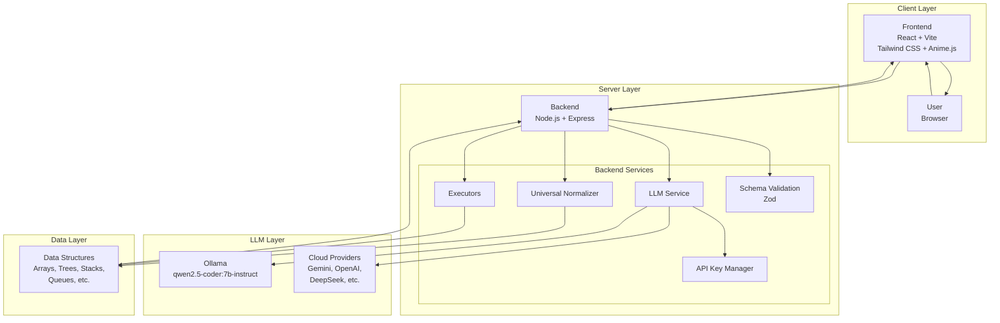
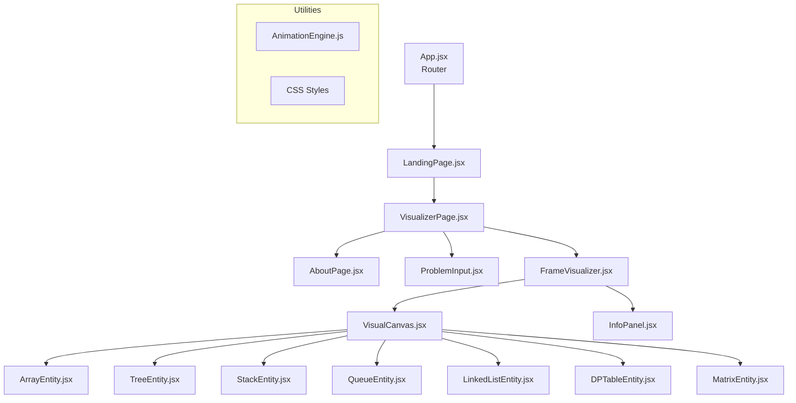
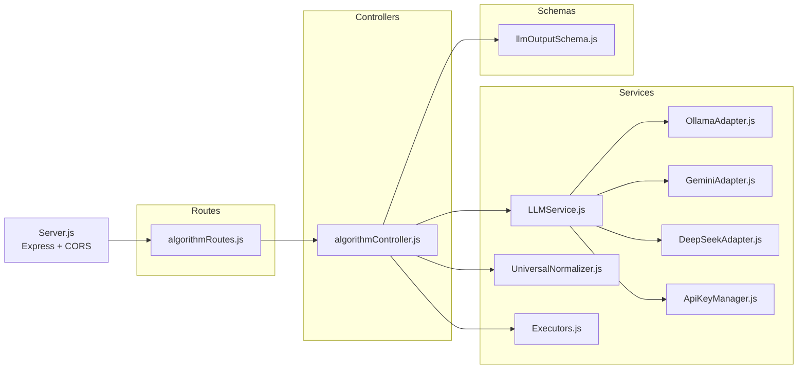
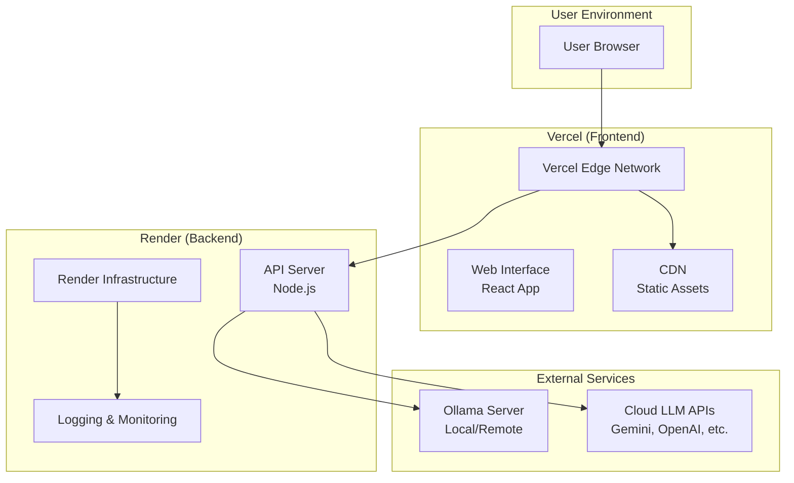
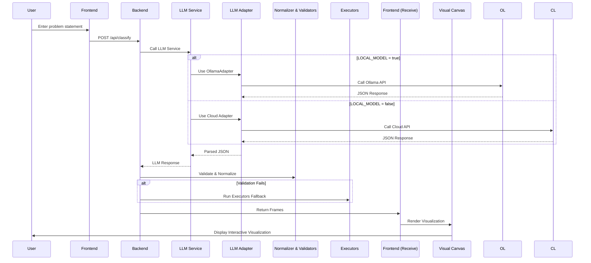

# AI Algorithm Visualizer (VishvaRoop) - System Architecture

## High-Level Architecture

## Component Architecture

### Frontend Architecture

### Backend Architecture

## Deployment Architecture

## Data Flow Architecture

## Key Architecture Principles

### 1. **Modular Design**
- Separation of concerns between frontend and backend
- Independent service modules for different functionalities
- Pluggable LLM adapters for easy provider switching

### 2. **Resilience & Fallbacks**
- Multiple fallback layers (LLM → Executors → Mock Data)
- Deterministic algorithms for reliable visualizations
- Graceful degradation when LLM output is imperfect

### 3. **Scalability**
- Stateless API design
- Environment-based configuration
- Horizontal scaling support for cloud deployment

### 4. **Extensibility**
- Entity-Action architecture for new data structures
- Plugin system for new LLM providers
- Modular visualization components

### 5. **Security**
- Environment variable-based configuration
- API key rotation and management
- Input validation and sanitization

## Technology Stack

### Frontend
- **Framework**: React 18
- **Build Tool**: Vite
- **Styling**: Tailwind CSS
- **Animations**: Anime.js
- **Icons**: Lucide React
- **Routing**: React Router DOM

### Backend
- **Runtime**: Node.js
- **Framework**: Express.js
- **Validation**: Zod
- **HTTP Client**: node-fetch
- **AI Integration**: Google Generative AI, Ollama

### LLM Providers
- **Local**: Ollama with qwen2.5-coder:7b-instruct
- **Cloud**: Gemini, OpenAI, DeepSeek, Groq, Together AI

### Deployment
- **Frontend**: Vercel
- **Backend**: Render
- **CDN**: Vercel Edge Network