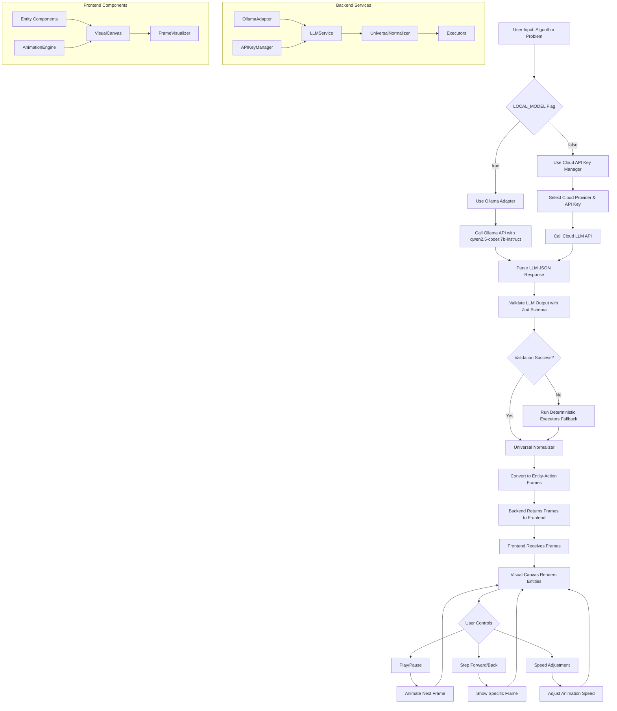

# AI Algorithm Visualizer (VishvaRoop) - System Flowchart

## Detailed Flow Description:

1. **User Input**: User enters an algorithm problem statement (e.g., "Sort array using bubble sort")

2. **Model Selection**: System checks `LOCAL_MODEL` environment variable:
   - If `true`: Uses Ollama with `qwen2.5-coder:7b-instruct` model
   - If `false`: Uses cloud providers with API key rotation

3. **LLM Processing**: 
   - Local: Calls Ollama API directly
   - Cloud: Selects provider based on availability and calls appropriate API

4. **Response Processing**:
   - Validates LLM output against Zod schema
   - If validation fails, runs deterministic executors as fallback
   - Normalizes output to entity-action format

5. **Frame Generation**: Converts normalized data to visualization frames with entities and actions

6. **Frontend Rendering**: 
   - Receives frames from backend
   - Visual Canvas renders appropriate entity components
   - Animation engine handles transitions

7. **User Interaction**: Play/pause, step controls, and speed adjustment allow user to control visualization

The system is designed to be resilient with fallback mechanisms ensuring visualization even when LLM output is imperfect.